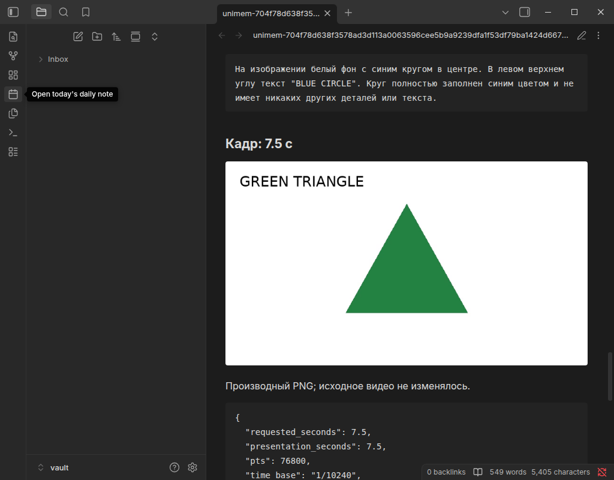

# Local video notes: evidence, 2026-10-03

Scope: one bounded local MP4 → existing ASR → up to three sampled PNGs → optional
existing isolated vision → one VIDEO canonical object → explicit existing Connector
delivery. Three static images do not establish all events, motion, hidden actions
or causation. No model benchmark, original-video delivery, release or publication.

## Git and versions

PR #38 remained OPEN at `1c4ce968692c0d5813f1e33ce8c9c8b76ed66af7`; #39 remained
OPEN at the supplied `50b9081e5ebe8e7339b9e5f1f63447968f0b6558`.
Remote main was `4ea4c896e4c510ec0dd257cb34acb99af7699e3e` at start and handoff
preflight. Branch `feat/local-video-notes` depends on `feat/local-image-description`;
its PR base is that branch. Prior PRs were not merged or changed. Canonical/API
schema/package stay 0.3.0; browser dev version 0.6.0 and Connector dev version 0.3.0
identify the new UI and version-3 journal. No dependency/profile quality retuning.

Linux 6.12.108-1-MANJARO x86_64, AMD Ryzen 5 5500U, Python 3.13.13. Installed Zen
Flatpak 1.21.8b (commit `52a718450354954a8f925b86e6ae087bca8015533c811920e59ca4393f8204cf`),
Obsidian 1.13.7 through Electron 43. Node 24.14.1, TypeScript 5.8.3.
PyAV 16.1.0; linked libavformat 62.3.100, libavcodec 62.11.100,
libavutil 60.8.100, libswscale 9.1.100, libswresample 6.1.100.
Pillow 12.3.0, faster-whisper 1.2.1, ctranslate2 4.8.2, onnxruntime 1.30.0,
numpy 2.5.3. ASR remains multilingual base/int8/two threads; vision remains
Qwen3-VL-2B Q4_K_M + Q8_0 projector / llama.cpp b11146 with the existing prompt.
Exact model revisions, component hashes, parameters and raw output are retained in
[the canonical result](assets/local-video-2026-10-03/result.json).

## Automated evidence — fake inference, real codecs/processes

- Full `pytest --cov=core --cov=unimem_api`: **4471 passed**, 306.10 s,
  **95.80% coverage**, existing 90% floor retained. A later decoder-context-change
  regression was added and the complete video suite rerun: **34 passed**, 6.23 s.
- `ruff check .`, `ruff format --check .`, strict `mypy`: pass.
- Browser `npm test`: **613 passed**. Connector `npm test`: **111 passed**.
- TypeScript build and browser lint pass; lint retains the two existing mixed
  Gecko/Chromium service-worker and Firefox Android minimum-version warnings.
- Added CI video job installs pinned decoder/ASR dependencies but no weights;
  it fails if decoder/process tests skip. It is separate from real-model evidence.

Checks cover synthetic H.264/AAC, unsupported MIME/container/codec, corrupt/truncated
MP4, geometry/duration/packet/frame/pixel/derivative limits, external-open refusal,
VFR, nonzero start, delayed audio, audio discontinuity, missing PTS, actual sampled
PTS, and a changing decoder context that must not hide a resolution change.
Pipeline doubles cover no_audio/no_speech/not_requested, sequential ASR/vision,
profile/mode replay/conflicts, failed stages, one VIDEO result, source-disabled
reads/render/delivery and no repeated inference. Real processes cover wall/RSS
termination, wait/reap, shared-slot release, shutdown while waiting, Linux parent
death, actual uvicorn SIGTERM/SIGKILL with a deliberately synthetic busy child tree,
and recovery without reexecution. These process tests are not real-model runs.

Frozen Python/TypeScript v1/v2/v3 fixtures cover manifest/digest/version separation,
receiver isolation and old ACK refusal. Connector tests inject crashes/failures at
each PNG, before/after Markdown, every journal persist, and ACK/response loss;
foreign-file conflict, own intent/digest recovery, no post-import restoration and
lease/settings/unload fences are covered. Multi-file writes remain non-atomic.

Commands used:

```sh
.venv/bin/ruff check .
.venv/bin/ruff format --check .
.venv/bin/mypy
.venv/bin/pytest --cov=core --cov=unimem_api --junitxml=/tmp/unimem-video-final.xml -q
.venv/bin/pytest tests/unit/video -q
npm test --prefix clients/browser-extension
npm test --prefix clients/obsidian-plugin
npm run lint --prefix clients/browser-extension
npm run build --prefix clients/browser-extension
npm run check-package --prefix clients/browser-extension
npm run build --prefix clients/obsidian-plugin
```

Loopback/process checks were run outside the execution sandbox after it rejected
local TCP. No failures were reclassified as passing: the initial full run exposed
a missing video-recovery storage-error guard and two route-set assertions; these
were corrected before the passing gate above.

## Real models — exactly one speech clip and three description calls

The [fixture generator](../scripts/create-video-fixtures.py) uses a previously
approved public Apache-2.0 Vosk audio sample and generated shapes, not personal
Videos/voice recordings. See [source/recipe](LOCAL_VIDEO.md#reproduce-the-small-acceptance-inputs)
and [frozen input facts](assets/local-video-2026-10-03/fixture.json).
The independent known scenes are red square [0,3.4), blue circle [3.4,6.8), green
triangle [6.8,10) seconds. The audio was scheduled at 1 s; decoded AAC begins at
0.936 s (priming). That actual offset is retained, not rounded to the intended 1 s.

| Input | Bytes | SHA-256 |
| --- | ---: | --- |
| 10 s speech/scenes MP4 | 89560 | `f99877d73d6e30b5cd44f1d08e2a1bcb3b3efa7bc7fa966b378ebea7d17bedda` |
| 3 s no-audio MP4 | 7510 | `c8a26e158e884448a20cc1917e65cc752dd8f48972b615c0edc01534ac4e4b65` |
| Source Vosk WAV | see source fixture | `dcfea5712c43a43ba7ae8083afb39d36993e5a69c46e88b68aaa72b65cb615bb` |

The native operation `4c7bc799-f797-44d7-81ca-089213e3b187` durably accepted at
13:45:02.713960 UTC and committed complete at 13:47:58.525348 UTC. Execution including
child startup/exit was **176.64 s**. [Measurements](assets/local-video-2026-10-03/metrics.json):

| Stage | Seconds |
| --- | ---: |
| Extract/decode | 0.816 |
| Existing ASR, separate PCM process | 6.278 |
| Frame 1 description | 56.796 |
| Frame 2 description | 56.296 |
| Frame 3 description | 54.914 |

Peak sampled process-tree RSS **2,100,117,504 bytes** (~1.96 GiB). Sampling sums
resident pages conservatively, including shared pages; this is not a benchmark or
an upper bound on all possible inputs. **182/182 health requests succeeded** while
processing: median 2.15 ms, p95 11.63 ms, max 78.08 ms. The serial child lifetimes
release ASR before starting vision; no concurrent frame inference occurred.

Targets/actual times were 2.5/2.5, 5/5, 7.5/7.5 s, video stream 0,
time_base 1/10240, PTS 25600/51200/76800. The saved PNGs show the known corresponding
shape/colour/label. A final decoder-only rerun after the context-change guard
produced the same three PNG digests; it made no additional model calls.

**ASR quality:** reference is “one zero zero zero one / nine oh two one oh / zero
one eight zero three”. Output is `1-0-0-0-1, 902-1-0, 0-1-8-0-3`, one cue
[1.496,9.086] on the common movie clock. The digit sequence is retained; punctuation,
word spelling and original pauses are not transcribed verbatim. This is cue timing,
not audited word alignment, diarization or a claim of general speech accuracy.

**Vision quality:** all three descriptions identify the shown shape, colour and
label. The triangle answer adds an unnecessary statement about no indication of
a diagram/interface. It is retained as model output, not corrected by another LLM.
The tiny clean shape fixture does not measure real-world visual accuracy or
prompt-injection resistance. No causal/motion/all-events narrative is generated.
Raw/parsed descriptions, provenance and independent transcript are in the result.

The separate no-audio operation `042fd0ee-1d28-4a00-9a39-444588ea8d90` completed in
**1.038 s**, peak tree RSS **89,665,536 bytes**, extraction 0.373 s. Speech was
requested, but no audio track existed; ASR did not run. Description was explicitly
off. Targets 0.75/1.5/2.25 s yielded actual 0.8/1.5/2.3 s. Its identical static
pixels at distinct times remain three observations, not three distinct scenes.
[Saved result](assets/local-video-2026-10-03/silent-result.json). No second vault note
was sent. Real no_speech was not rerun; fake no_speech contracts and prior ASR evidence
remain separate.

## Installed Zen → standalone Connector → offline Obsidian

Fresh isolated profiles/data/vault were created under `/tmp/unimem-video-20261003`.
Only `unimem-connector` was enabled: no Veynrel or Companion. The installed Zen used
the temporary 0.6.0 dev package; native file input selected the source, en speech,
frames and explicit descriptions. After acceptance the page was closed and reopened;
the same ID/stage returned. Ordinary DOM preview loaded three 768×432 images and
separate text. No model output was substituted by the automation.

Through the Connector's own settings UI, a separate test receiver credential was
saved, the new PNG-frame permission explicitly enabled, connection checked and
receiving enabled. Legacy image permission remained off. Explicit Send in Zen
created v3 delivery `657a4659-4d1e-485e-9885-eacf05aa13cc`.
[Verification](assets/local-video-2026-10-03/verification.json):

- Exactly **one Markdown + three PNG**, no MP4 in the test vault.
- Markdown equals [the frozen browser snapshot](assets/local-video-2026-10-03/snapshot.md)
  byte-for-byte: SHA-256 `1bcff6fae6b635ed22693119c0e81adb4c6836fa7690629f837151da7df82b1c`.
- All PNG byte lengths/digests match the ordered manifest. Package SHA-256
  `e7cd9bbc995dcbac91cde6fa224413595fd2b784d24c688c2951622e192f5191`.
- Server `imported`; journal v3 has one acknowledged entry with three written assets.
  Receiver ID survived plugin unload/reload; repeated polls made no duplicate files.
- API stopped/restarted with video/ASR/vision disabled: original receipt, preview,
  snapshot and delivery remained readable. No inference ran on refresh/replay.
- API then stopped fully (port 8765 closed). Reading view was recreated and scrolled
  through its lazy-rendered content: all three local PNGs loaded at 768×432.
  [Offline observations](assets/local-video-2026-10-03/offline.json) and screenshot below.



## Dev packages and remaining gates

Both dev packages were built twice and their hashes compared. Browser package
source checker passed (27 shipped files); no credentials/absolute build paths.

| Artifact | Version | SHA-256 |
| --- | --- | --- |
| `clients/browser-extension/dist/unimem-browser-0.6.0-dev.zip` | 0.6.0 | `193a8faea49ae0ae833af2964a6a47bcc40319a2af4be30cdb074e9bffac7607` |
| `clients/obsidian-plugin/dist/unimem-connector/main.js` | 0.3.0 | `edc08970ec2ee68b2a105f3a2e611f39f135a31a411810cf7b4921c14bc96a27` |
| `clients/obsidian-plugin/dist/unimem-connector/manifest.json` | 0.3.0 | `8d235945f9e104ee852c348ce46e0838174dafda2d8a3b84b1cd62563672bf7b` |

PASS: deterministic contracts, one real-model native pipeline, no-audio native
processing, no duplicate import, offline frame display, additive server migration,
old Connector journal migration and reproducible dev packages.

NOT RUN for this slice: signed install/browser restart/update, Firefox/Chromium,
Windows/macOS, arbitrary phone recordings/rotations/HDR, real-model cancellation
mid-inference (process/fence cancellation is tested with synthetic children and the
existing isolated adapter's tests). Three genuine vision calls suffice here; no
large benchmark or general accuracy/speed claim. Old B4 and ASR listening/quality
gates remain open. Multi-file writes are not atomic and ambiguous partial results
remain explicit. PR stays open/unmerged; GitHub CI status is reported in the handoff,
not inferred from local checks.
