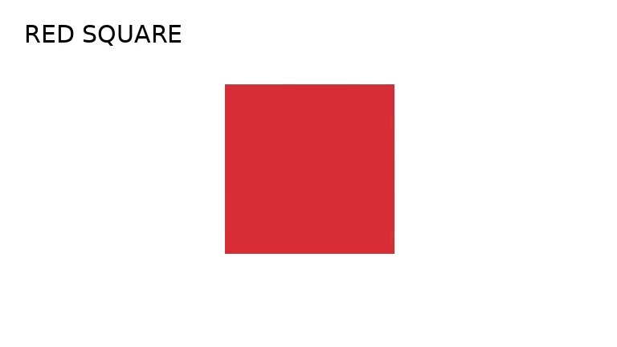
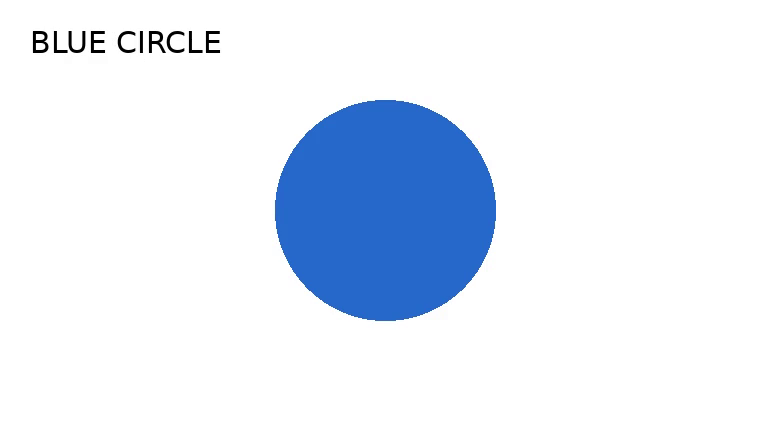
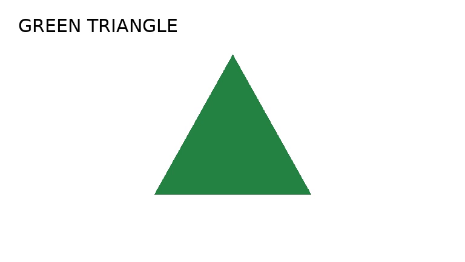

# Видео — речь и выбранные кадры

Источник: локальный MP4.
Capture ID: `c5283dc3-2c4e-42ec-ae86-995ff7866df6`
Content ID: `7e3aea4a-b3c7-463d-95c7-20474aef32b6`
Operation ID: `4c7bc799-f797-44d7-81ca-089213e3b187`
Original SHA-256: `f99877d73d6e30b5cd44f1d08e2a1bcb3b3efa7bc7fa966b378ebea7d17bedda`

Оригинальное видео осталось в UniMem. Obsidian получает заметку и выбранные PNG.

## Выполненная обработка

```text
{
  "request": {
    "operation_id": "4c7bc799-f797-44d7-81ca-089213e3b187",
    "file_ref": "sha256:f99877d73d6e30b5cd44f1d08e2a1bcb3b3efa7bc7fa966b378ebea7d17bedda",
    "declared_mime": "video/mp4",
    "speech": true,
    "language": "en",
    "frames": true,
    "describe": true,
    "captured_at": "2026-10-03T13:44:58.193000Z",
    "decoder": "mp4-h264-aac/1",
    "sampling": "quarters-first-pts/1",
    "asr_profile": "faster-whisper-base-int8/1",
    "vision_profile": "qwen3-vl-2b-q4-b11146-visible-ru/1"
  },
  "speech_outcome": "transcribed",
  "frames_outcome": "extracted",
  "vision_outcome": "described",
  "audio": {
    "stream_index": 1,
    "codec": "aac",
    "sample_rate": 16000,
    "channels": 1,
    "offset_seconds": 0.936,
    "start_pts": 14976,
    "time_base": "1/16000",
    "pcm_samples": 134144,
    "pcm_rate": 16000,
    "decoded_frames": 131
  },
  "stage_seconds": {
    "extracting": 0.8160513000038918,
    "transcribing": 6.278176093997899,
    "frame_1": 56.796385752997594,
    "frame_2": 56.29591728601372,
    "frame_3": 54.91441425299854
  }
}
```

Выборка: ¼, ½ и ¾ длительности; первый кадр с PTS не раньше позиции, без дублей. Это не выбор самых важных кадров.
Общая шкала: исходные PTS минус 0 с; длительность 10.0 с.
Метки речи переведены из PCM на эту же шкалу с сохранённым смещением аудио.

## Расшифровка

ASR выполнен. Возможны ошибки распознавания.
```text
{"model": "Systran/faster-whisper-base", "model_revision": "ebe41f70d5b6dfa9166e2c581c45c9c0cfc57b66", "selected_language": "en", "detected_language": "en", "parameters": {"device": "cpu", "compute_type": "int8", "cpu_threads": 2, "num_workers": 1, "beam_size": 5, "temperature": 0.0, "condition_on_previous_text": false, "vad_filter": true, "min_silence_duration_ms": 500, "task": "transcribe", "sample_rate": 16000}}
```
[1.496 – 9.086 с]
```text
1-0-0-0-1, 902-1-0, 0-1-8-0-3
```

## Выбранные кадры

### Кадр: 2.5 с



Производный PNG; исходное видео не изменялось.
```text
{
  "requested_seconds": 2.5,
  "presentation_seconds": 2.5,
  "pts": 25600,
  "time_base": "1/10240",
  "stream_index": 0,
  "encoded_width": 768,
  "encoded_height": 432,
  "width": 768,
  "height": 432,
  "rotation_degrees": 0,
  "transform": "fit-1024-rgb24-bilinear/1",
  "cropped": false,
  "sha256": "3f82d4177f032421cbfce07c8ef48330b3a5932a44fa5bd0ac6e5e98a203456e",
  "size_bytes": 8472,
  "source_asset_id": "028af1c1-312c-46bd-874b-f08682745808",
  "source_sha256": "f99877d73d6e30b5cd44f1d08e2a1bcb3b3efa7bc7fa966b378ebea7d17bedda"
}
```
Описание этого кадра моделью (не OCR):
```text
На изображении белый фон с красным квадратом. В левом верхнем углу текст "RED SQUARE". Квадрат расположен в центре изображения.
```

### Кадр: 5.0 с



Производный PNG; исходное видео не изменялось.
```text
{
  "requested_seconds": 5.0,
  "presentation_seconds": 5.0,
  "pts": 51200,
  "time_base": "1/10240",
  "stream_index": 0,
  "encoded_width": 768,
  "encoded_height": 432,
  "width": 768,
  "height": 432,
  "rotation_degrees": 0,
  "transform": "fit-1024-rgb24-bilinear/1",
  "cropped": false,
  "sha256": "f935f59495f395433ca53b6d5be2ce7195d436704798af066d2f958fe84230fa",
  "size_bytes": 17025,
  "source_asset_id": "028af1c1-312c-46bd-874b-f08682745808",
  "source_sha256": "f99877d73d6e30b5cd44f1d08e2a1bcb3b3efa7bc7fa966b378ebea7d17bedda"
}
```
Описание этого кадра моделью (не OCR):
```text
На изображении белый фон с синим кругом в центре. В левом верхнем углу текст "BLUE CIRCLE". Круг полностью заполнен синим цветом и не имеет никаких других деталей или текста.
```

### Кадр: 7.5 с



Производный PNG; исходное видео не изменялось.
```text
{
  "requested_seconds": 7.5,
  "presentation_seconds": 7.5,
  "pts": 76800,
  "time_base": "1/10240",
  "stream_index": 0,
  "encoded_width": 768,
  "encoded_height": 432,
  "width": 768,
  "height": 432,
  "rotation_degrees": 0,
  "transform": "fit-1024-rgb24-bilinear/1",
  "cropped": false,
  "sha256": "861802f50ab5f194db8d49ba85d2160fb7dcc96b074377f751fdf518e45142db",
  "size_bytes": 16837,
  "source_asset_id": "028af1c1-312c-46bd-874b-f08682745808",
  "source_sha256": "f99877d73d6e30b5cd44f1d08e2a1bcb3b3efa7bc7fa966b378ebea7d17bedda"
}
```
Описание этого кадра моделью (не OCR):
```text
На белом фоне изображена одна зеленая треугольная фигура. В левом верхнем углу текста "GREEN TRIANGLE". Ниже не указано, что это схема или интерфейс, но текст и фигура четко видны.
```


Визуальная выборка ограничена показанными статичными кадрами. Она не описывает все события ролика, движение между кадрами, скрытые действия или их причины. Машинные описания могут выдумывать и пропускать детали. ASR и vision приведены отдельно и не исправляют друг друга.
